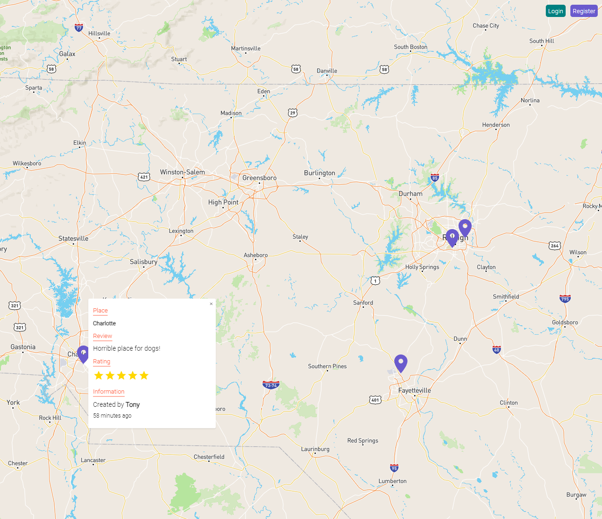

# Doggo Destinations

---



## Description

Doggo Destinations is a demo application of a map social media application that allows users to share their experiences at certain locations around the world. This is especially important for people with pets, and which locations are pet friendly and which are not. People can register, and log in to see other users' locations, as well as their own. Users have features such as the ability to drop a pin on the map, and fill out a popup form with a title, description, and a rating system for the location. Doggo Destinations is also mobile friendly. 

## Set up and Installation

```bash
-- Frontend --
npx create-react-app project-name
npm add react-map-gl
npm install @mui/icons-material @mui/material @emotion/styled @emotion/react
npm install axios
npm install cors
npm install timeago.js
npm i worker-loader

--Backend--
npm i mongoose
npm i express
npm i nodemond
npm i bcrypt
npm i cors

```
- Mapbox is a Javascript library for vector mapping on the web.
- React-map-gl makes Mapbox a fully controlled reactive component.
- Axios is used for making API requests
- Timeago is a react dependency used for tracking time
- Mui is a React component library of UI tools. Mui/Icons must be installed separately. 

## :globe_with_meridians: API

This is the monolith application that contains both the frontend and the backend. The frontend uses React, and the backend uses Mongoose and  Express.

## :bookmark_tabs: Features

- Ability to drop pins containing information pertinent to users' experience at the location.
- Ability to view other users' pins and info at other locations.

## :pushpin: Future plans

- Users will be able to drop pins that contain photos.
- Users will be able to edit pins.
- Users will have more fields, such as photo.
- Users will be able to comment on other users' pins.
- "Filter items by" functionality.
- Adding and deleting comments.
- Notification system with app alerts
- Include a landing page.

---

## Credits
### Front-end
Anthony Connell ([github](https://github.com/AnthonyConnell))

Deanna Ireland ([github](https://github.com/Typerfish))

### Back-end
Jennika Wilson ([github](https://github.com/Justanthr))

Jacob Lamb ([github](https://github.com/jdlamb4))

--

Map used from  [Mapbox](mapbox.com)

---

## License

MIT License

Copyright (c) 2022 Doggo Destinations

Permission is hereby granted, free of charge, to any person obtaining a copy
of this software and associated documentation files (the "Software"), to deal
in the Software without restriction, including without limitation the rights
to use, copy, modify, merge, publish, distribute, sublicense, and/or sell
copies of the Software, and to permit persons to whom the Software is
furnished to do so, subject to the following conditions:

The above copyright notice and this permission notice shall be included in all
copies or substantial portions of the Software.

THE SOFTWARE IS PROVIDED "AS IS", WITHOUT WARRANTY OF ANY KIND, EXPRESS OR
IMPLIED, INCLUDING BUT NOT LIMITED TO THE WARRANTIES OF MERCHANTABILITY,
FITNESS FOR A PARTICULAR PURPOSE AND NONINFRINGEMENT. IN NO EVENT SHALL THE
AUTHORS OR COPYRIGHT HOLDERS BE LIABLE FOR ANY CLAIM, DAMAGES OR OTHER
LIABILITY, WHETHER IN AN ACTION OF CONTRACT, TORT OR OTHERWISE, ARISING FROM,
OUT OF OR IN CONNECTION WITH THE SOFTWARE OR THE USE OR OTHER DEALINGS IN THE
SOFTWARE.
